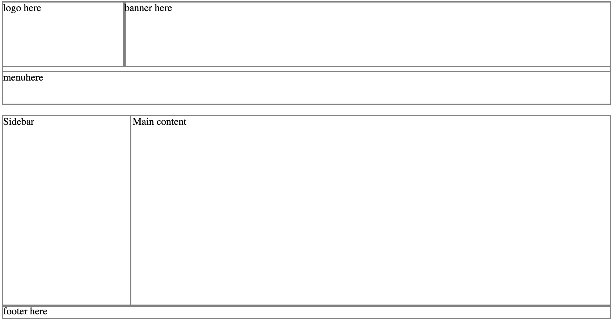

## 8.HTML & CSS - Positioning

1. Skapa en ny katalog.

1. I denna skapar ni en index.html med basstruktur.

1. Skapa ett styles.css dokument som ni lägger i samma katalog som index.html.

1. Importera styles.css i ```<head>``` index.html.

1. Återskapa layouterna som visas på bilderna nedan. Dessa skall ligga under(inte bakom) varandra.





1. Skapa nu en div som alltid skall sitta fast i botten av sidan, en s.k. sticky footer. Detta innebär att även om du scrollar på sidan så skall denna sitta i fast i botten.