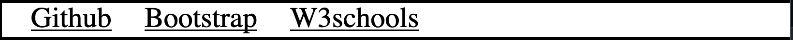
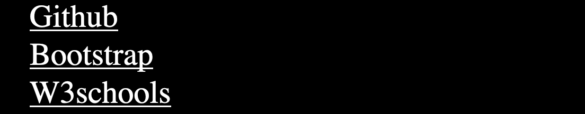
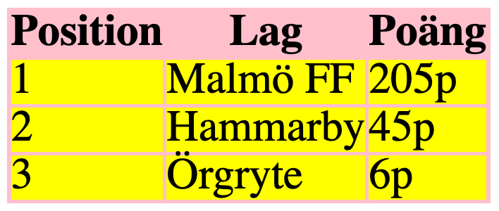

## Praktisk Omtentamen - HTML5 och CSS, 25 yrkeshögskolepoäng

### Beskrivning
Detta är en praktiskt tentamen som skrivs/utförs individuellt på plats i klassrummet.

### Regler:

* All form utav kommunikation online eller offline resulterar i ett underkänt betyg.
* Mobiltelefon skall stängas av innan tentamen börjar, om ni väntar ett viktigt samtal så skall detta meddelas innan tentamensstart.
* Det är ej tillåtet att använda hörlurar.

#### 

* Att besöka andra webbplatser än det 3 som nämns nedan resulterar i ett underkänt på tentamen.
  * [https://www.w3schools.com](https://www.w3schools.com)
  * [https://getbootstrap.com](https://getbootstrap.com/)
  * [https://github.com](https://github.com)

### Uppgifter och betyg

#### Uppgifter
Tentamen innehåller 12 uppgifter som är uppdelade i uppgifter för **Godkänt** och **Väl Godkänt**.
* Uppgift 1-7 är uppgifter för betyget **Godkänt** - maxpoäng **23p**
* Uppgift 8-11 är uppgifter för betyget **Väl Godkänt** maxpoäng **17p**

#### Betygsgränser:
* För ett ***Godkänt(G)*** betyg krävs **16p** på **Godkänt** delen.
* För ett ***Väl Godkänt(VG)*** betyg krävs **16p** på **Godkänt** delen samt **14p** på **Väl Godkänt** delen.

### Inlämning/Redovisning

Inlämning sker genom att ni skapar ett repo på github som ni döper till **omTentamen1_html_<tre_första_bokstäverna_förnamn>_<tre_första_bokstäverna_efternamn>** där ni lägger till filerna som ni skapade på tentamen (glöm inte att pusha slutgiltiga koden).

#### Uppgift lämnas in senast **16:15**.

## Uppgifter för betyget Godkänt (23p)

### Uppgift 1 (4p)
Skapa en ny katalog innehållande följande filer:
* index.html
* style.css

Skapa nu nedan i index.html:
* basstruktur = dvs de grundläggande element som behövs för en html sida
* titel = ```tentamen1_html_<tre_första_bokstäverna_förnamn>_<tre_första_bokstäverna_efternamn>```
* länka till style.css
* meta taggar för (author, description & charset)

## 

### Uppgift 2 (5p)
* Skapa nu en navigationsmeny som består utav en lista med 3 hyperlänkar som leder till webbsidorna:
  * https://github.com
  * https://getbootstrap.com
  * https://www.w3schools.com

* Denna navigation skall se ut som:
  * Fig.1 om skärmen är 500px eller större
  * Fig.2 om skärmen är 499px eller mindre.

Fig.1<br>


Fig.2<br>


## 

### Uppgift 3 (4p)
* Skapa en **tabell** som i fig.3 (med samma styling).
* Tänk på att använda rätt semantiska element.

fig.3<br>


## 

### Uppgift 4 (1p)
Skapa 5st ```<div>``` utan innehåller som uppfyller följande:
* Bredd = 300px
* Höjd = 300px

### Uppgift 5 (3p)
Skapa nu ett div element med id="funny-element" under listan, denna div skall uppfylla följande:
* Bredd = 100% av **viewport**
* Höjd = 5px
* Bakgrundsfärg = ljusblå
* Positionerad 10pixlar från toppen av fönstret
* Den skall vara 10pixlar från toppen **ALLTID** dvs scrollar man ner så skall den alltid synas 10px från toppen.

### Uppgift 6 (3p)
Lägg till bootstrap på valfritt sätt och lägg sedan till:
* En ```Button``` utav typen "primary".
* En ```Spinner```.

### Uppgift 7 (3p)
Skapa en rubrik med innehållet ```SEO```. Under denna skapar nu en **ordnad** lista med 6st list-items. 
Dessa items skall innehålla 6 olika åtgärder man kan ta för att sökmotor-optimera (SEO) sin sida 
(meta taggar räknas som 1 åtgärd).

## 

## Uppgifter för betyget Väl Godkänt (17p)

## 

### Uppgift 8 (4p)
Skapa en rubrik med innehållet **SEO och nyckelord** och besvara följande frågor i en paragraf direkt under rubriken.
* Vart på sin sida är det viktigt att man använder sina nyckelord?
* Hur skall man tänka när man väljer sina nyckelord för att ha chansen att ranka högt på Google?

## 

### Uppgift 9 (4p)
Skapa en rubrik med innehållet **Responsiv webbdesign** och besvara följande frågor i en paragraf direkt under rubriken.
* Vad innebär responsiv webbdesign och varför är det viktigt?
* Vad innebär mobile first och varför är det vanligt idag?
* Det finns 2 ställen man kan ange/använda media queries på, vilka är dessa?

## 

### Uppgift 10 (3p)
Skapa en rubrik med innehållet **Google** och besvara följande frågor i en paragraf direkt under rubriken.
* Beskriv hur det går till när Google hittar, indexerar och rankar webbsidor, använd minst 1 extern källa.

## 

### Uppgift 11 (6p)
Skapa en rubrik med innehållet **Review** och granska koden nedan och indentifiera fel och saker som bör göras annorlunda. Skriv dessa i en paragraf direkt under rubriken.

**Glöm inte att motivera varför.**

```
<html lang="en">
  <head>
    <style>
      h3 {
        color: blue;
      }
      p {
        color: red; 
        position: absolute;
        top: 0px; 
        bottom: 0px;
      }
      .nav {
        background: lightgreen;
      }
    </style>
    <meta name="viewport" content="width=device-width, initial-scale=1.0">
    <meta http-equiv="X-UA-Compatible" content="ie=edge">
    <meta name="keywords" content="Jane Doe, tattoos, konst, växjö, sleeves">
    <header>Jane Does tatuerare</header>
  </head>

  <body>
      <div id="nav">
      <ul>
        <a id="list-item" href="index.html">Startsida</a> 
        <a id="list-item" href="about.html">Om oss</a>
        <a id="list-item" href="contact.html">Kontakt</a>
      </div>


      <section id="min-sektion">
        <h1>Hej och välkomna!</h1>
        <p>Jane Doe's tatueringsstudio ligger i hjärtat av Småland. Klicka runt på sidan för att utforska vårt utbud.<p>
        
      </section>

      <foter style="color: green;">
        <p>Kontakta oss på:<span id="highlighted">Tel: 0470-99999</span></p>
      </foter>
  </body>
<html>
```
# GLÖM INTE ATT COMMITA OCH PUSHA INNAN INLÄMNING!